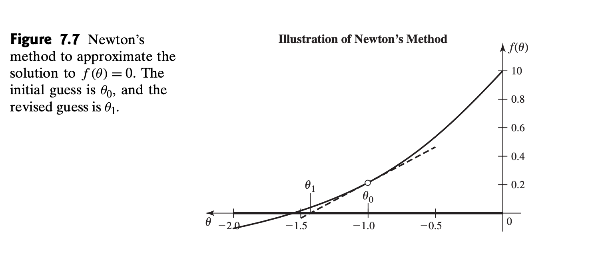

# Data and Initial Simulation Work
```{r Load packages and functions}
library(tidyverse)
library(ImpulseDE2)
library(DESeq2)
library(gridExtra)
library(grid)
library(gridGraphics)
library(reshape2)
library(data.table)
library(knitr)

foo<-function(){}

sigmoid_function<-function(b, h_0, h_1, t_1, t){
h_0 + (h_1-h_0)*(1/(1+exp(1)^(-b*(t-t_1))))
}

impulse_function<-function(b, h_0, h_1, h_2, t_1, t_2, t){
  (1/h_1)*(h_0+(h_1-h_0)/(1+exp(-b*(t-t_1))))*(h_2+(h_1-h_2)/(1+exp(b*(t-t_2))))
}
```

```{r Upstream filtering, cache=TRUE, echo=FALSE}
allCounts <- read.csv("LB_Time_Course_GCA_000005845.2_ASM584v2_genomic_counts copy.tsv", header = T, sep = "\t")
allCounts$GeneidBackup = allCounts$Geneid
allCounts <- allCounts %>% tidyr::separate(GeneidBackup, c("feature", "rest"), sep="[:]")
allCounts %>% group_by(feature) %>% summarise(number_of_genes = n())
# Now, we must extract the genenames from each Geneid. However, each feature has a slightly different pattern, and we will need to do the features separately. 

# IGR's (this includes AS_IGRSs): 
# IGR stands for intergenic region which means a region between coding sequences or different types of RNA. Therefore, we'll have a start.bnum and end.bnum as well as a start.genename and end.genename. Note that not all genes will have a bnum (only CDS/AS_CDS do)
bnum = "b[0-9]{4}" # what do bnumbers look like?
genename = ",[a-z]{3}[A-Z,]." # what does a genename look like? this is regexp lingo
rna.name = ",rna[0-9].." # what does an RNA name look like?
igr <- allCounts %>% filter(feature %in% c("IGR", "AS_IGR"))
igr$GeneidBackup = igr$Geneid # store the Geneid
igr <- igr %>% separate(GeneidBackup, c("Geneid1", "Geneid2"), sep = "[/]") # separate the first part of the Geneid which talks about the IGR's start gene (Geneid1) and the last part of the IGR Geneid which talks about that IGR's end gene (Geneid2). 
igr$feature1 <- separate(igr, Geneid1, c("feature1", "rest"), sep = "[,]")$feature1
igr$feature1 <- separate(igr, feature1, c("rest", "feature1"), sep = "[()]")$feature1 #start feature
igr$feature2 <- separate(igr, Geneid2, c("feature2", "rest"), sep = "[,]")$feature2
igr$start.gene <- case_when( #start gene name: many possibilities!
    igr$feature1 == "CDS" ~ str_extract(igr$Geneid1, genename), #if the start feature was CDS, then the name is going to be genename style, so we extract a genename-type thing from Geneid1
    TRUE ~ str_extract(igr$Geneid1, rna.name)) #otherwise, it's going to have an RNA-style name, so we extract the rna.name from Geneid1
igr$end.gene <- case_when( #end gene neame: similar to above!
    igr$feature2 == "CDS" ~ str_extract(igr$Geneid2, genename), # if the end feature was CDS, then we're looking for a genename-type bit from Geneid2
    TRUE ~ str_extract(igr$Geneid2, rna.name)) #otherwise, it must be an RNA-style label of some sort. 
igr$start.bnum <- case_when(
    igr$feature1 == "CDS" ~ str_extract(igr$Geneid1, bnum), #bnums only exist for CDS, so we check if the feature is CDS before extracting a bnum from Geneid1
    TRUE ~ "none") # if not CDS, then no bnum exists so we can put "none"
igr$end.bnum <- case_when(
    igr$feature2 == "CDS" ~ str_extract(igr$Geneid2, bnum), #same thing as above but for end bnum
    TRUE ~ "none")
# now get rid of all those pesky commas that got into our start.gene labels. I could have not included the punctuation in my regex pattern, but then str_extract() might have gotten confused with a less specific pattern
igr <- igr %>% separate(start.gene, into = c("comma", "start.gene"), sep = "[,]") %>% dplyr::select(-comma) %>% separate(end.gene, into = c("comma", "end.gene"), sep = "[,]") %>% dplyr::select(-comma)
allCounts <- full_join(igr, allCounts) #add this new information to allCounts!
# CDS
# have bnum and genename columns
# left join to allCounts
genename = ":[a-z]{3}.." #new genename pattern
#bnum pattern stays the same
cds <- allCounts %>% filter(feature %in% c("AS_CDS", "CDS")) 
cds$genename <- str_extract(cds$Geneid, genename) #extract those genenames!
cds$bnum <- str_extract(cds$Geneid, bnum) # extract them bnums!
#get rid of the pesky colon that was part of the pattern
cds <- cds %>% separate(genename, into = c("colon", "genename"), sep = ":") %>%
  dplyr::select(-colon)
allCounts <- full_join(allCounts, cds) #add the new info to allCounts
#ncRNA
#ncRNA doesn't have bnums, but id's which we'll put in the genename column
rna.name = ":rna[0-9].." #new rna.name pattern
rna <- allCounts %>% filter(feature %in% c("ncRNA", "AS_ncRNA"))
rna$genename <- str_extract(rna$Geneid, rna.name) #record those rna.names
rna <- rna %>% separate(genename, into = c("colon", "genename"), sep = ":") %>%
  dplyr::select(-colon) #get rid of colon
allCounts <- full_join(allCounts, rna) #update allCounts with ncRNA names!
#rRNA
rRNA <- allCounts %>% filter(feature %in% c("rRNA", "AS_rRNA"))
rRNA$genename <- str_extract(rRNA$Geneid, rna.name) #same rna.name pattern exists as above, so extract those rna.names! And store the result as genename - I know. This is just for convenience's sake so we have a common column to refer to when we want the short hand name for a gene. 
rRNA <- rRNA %>% separate(genename, into = c("colon", "genename"), sep = ":") %>%
  dplyr::select(-colon) #get rid of that colon
allCounts <- full_join(allCounts, rRNA) #update allCounts
#tRNA -- analogous to rRNA above. 
tRNA <- allCounts %>% filter(feature %in% c("tRNA", "AS_tRNA"))
tRNA$genename <- str_extract(tRNA$Geneid, rna.name)
tRNA <- tRNA %>% separate(genename, into = c("colon", "genename"), sep = ":") %>%
  dplyr::select(-colon)
allCounts <- full_join(tRNA, allCounts)
# remove the NA rows we just created by full_joining while adding the ncRNA, rRNA, tRNA genenames
allCounts <- filter(allCounts, feature %in% c("IGR", "AS_IGR") | genename != "NA")

#filter by CDS, NA, 0 sums, resolve duplicates
#filter
ecounts<-allCounts %>% filter(feature=="CDS")
#remove NA and rows of 0's
ecounts<-ecounts[rowSums(is.na(ecounts)) != ncol(ecounts), ]
ecounts<-subset(ecounts, rowSums(ecounts[,2:37])>0)
#resolve duplicates (takes the first row corresponding to a genename)
ecounts<- ecounts %>% dplyr::distinct(genename, .keep_all=TRUE)
rownames(ecounts)<-ecounts$genename
ecounts<-ecounts[,2:37]
View(ecounts)
```

```{r Normalized counts}
colidesign<-data.frame(time=as.factor(rep(c("0", "30", "60", "90", "120", "150"), 6)), rep=as.factor(c(rep(1, 12), rep(2,12), rep(3,12))), treatment=as.factor(c(rep("WT",6), rep("treat",6), rep("WT",6), rep("treat",6), rep("WT",6), rep("treat",6)))) %>%
  mutate(timetreat=paste(treatment, time, sep=""))

ddsecoliCountTable <- DESeqDataSetFromMatrix(
  countData = ecounts,
  colData = colidesign,
  design = ~ timetreat)

#ID'ed 728 DEGs w/ padj<0.01
#ID genes DE over time (0 min to 150 min in WT strain)
ecolidds<-DESeq(ddsecoliCountTable)
normecounts<-as.data.frame(counts(ecolidds, normalized=TRUE))
```

```{r Run ImpulseDE2 and Noise Assessment}
stoebeldesign<-data.frame(Sample=colnames(ecounts), Condition=c(rep("case",6), rep("control",6), rep("case",6), rep("control",6), rep("case",6), rep("control",6)), Time=rep(c(0,30,60,90,120,150),6))

impulse_ecoli<-ImpulseDE2::runImpulseDE2(as.matrix(ecounts), stoebeldesign, boolCaseCtrl=TRUE, vecConfounders=NULL, scaQThres = 0.01, boolIdentifyTransients = TRUE, boolVerbose=FALSE)

#DEGs from previous intersection
ecoli_degs<-read.csv("ecoli_DEGs copy.csv", header=TRUE)

#find monotonic, transient, other genes
DEmono<- impulse_ecoli$dfImpulseDE2Results[impulse_ecoli$dfImpulseDE2Results$isMonotonous==TRUE,] %>% filter(padj<0.01) %>% filter(Gene %in% ecoli_degs$x)
DEtrans<-impulse_ecoli$dfImpulseDE2Results[impulse_ecoli$dfImpulseDE2Results$isTransient==TRUE,] %>% filter(padj<0.01) %>% filter(Gene %in% ecoli_degs$x)
DEother<-impulse_ecoli$dfImpulseDE2Results %>% filter(padj<0.01) %>% filter(isTransient==FALSE) %>% filter(isMonotonous==FALSE) %>% filter(Gene %in% ecoli_degs$x)

#extract parameters for sigmoidal genes
monoDE<-DEmono$Gene
monoparamsmat<-matrix(ncol=4, nrow=length(monoDE))
for (i in 1:length(monoDE)){
   monoparamsmat[i,]<-impulse_ecoli@lsModelFits[["case"]][[monoDE[i]]][["lsSigmoidFit"]][["vecSigmoidParam"]]}
monoparamsdf<-as.data.frame(monoparamsmat)
colnames(monoparamsdf)<-c("beta", "h0", "h1", "t")
rownames(monoparamsdf)<-monoDE

#Just some plotting
resid<-matrix(nrow=18)
for (i in 1:dim(monoparamsdf)){
  params=monoparamsdf[i,]
  means=rep(sigmoid_function(params[,1], params[,2], params[,3], params[,4], seq(0,150,30)), 3)
  points=normecounts[rownames(normecounts)==rownames(params), grepl("JH01", colnames(normecounts))]
  resids<-means-points
  resids<-as.numeric(paste(resids))
  resid<-cbind(resid, resids)
}
resid<-resid[,c(-1)]
colnames(resid)<-rownames(monoparamsdf)
resid<-cbind(resid, rep(seq(0,150,30), 3))
resid<-as.data.frame(resid)
colnames(resid)<-c(rownames(monoparamsdf), "time")
resid <- melt(resid ,  id.vars = 'time', variable.name = 'series')

#violin and smoth plot showing residuals as a function of time
ggplot(resid)+geom_violin(aes(x=factor(time), y=value))+ylim(-500, 500)

ggplot(resid)+geom_point(aes(x=jitter(time), y=value))+stat_smooth(aes(x=jitter(time), y=value))+ylim(-1000, 1000)
```

```{r How sensitive is simulation pipeline?}

plot_sim_trajectories<-function(gene="gadB", disp_noise_factor=1, n_sim_profiles=100, move_onset_time=0, showplot=FALSE){
  times<-rep(c(0,30,60,90,120,150),3)

  #design for sigmoid simulation through ImpulseDE2
  sigmoid_design<-data.frame(Sample=colnames(ecolidds)[grep("JH01", colnames(ecolidds))], Condition=c(rep("case",18)), Time=rep(c(0,30,60,90,120,150),3))
  geneparams<-monoparamsdf[match(gene, rownames(monoparamsdf)),]
  #change onset time parameter
  geneparams[,4]<-geneparams[,4]+move_onset_time

  ###extract means at each TP, scale by size factor
  size_facs<-sizeFactors(ecolidds)[grep("JH01", names(sizeFactors(ecolidds)))]
  means<-sigmoid_function(as.numeric(geneparams[,1]), as.numeric(geneparams[,2]), as.numeric(geneparams[,3]), as.numeric(geneparams[,4]), unique(times))
  repmeans<-c(rep(means, 3))

  #index to find dispersion for gadB
  disp_index=match(gene, names(impulse_ecoli@vecDispersions))
  disp<-as.numeric(impulse_ecoli@vecDispersions[disp_index])

  #generate simulated read count data for 100 trajectories w/ proper NB noise
  differentially_expressed<-matrix(ncol=18, nrow=n_sim_profiles)
  for (i in 1:18){
    expressions<-c()
    #pseudo-counts (+1) to ensure that nonzero
    expressions<-c(expressions, rnbinom(n=n_sim_profiles, mu=repmeans[i], size=disp/disp_noise_factor)+1)
    differentially_expressed[,i]<-round(expressions*as.numeric(size_facs[i]))
  }
  differentially_expressed<-as.matrix(differentially_expressed)
  colnames(differentially_expressed)<-colnames(ecolidds)[grep("JH01", colnames(ecolidds))]
  rownames(differentially_expressed)<-paste(rep("gene", n_sim_profiles), seq(1,n_sim_profiles))
  
  #set manual dispersions
  dispersions<-rep(disp, n_sim_profiles)
  names(dispersions)<-paste(rep("gene", n_sim_profiles), seq(1,n_sim_profiles))
  
  #fit impulse models
  sim_sigmoid<-ImpulseDE2::runImpulseDE2(differentially_expressed, sigmoid_design, boolCaseCtrl=FALSE, vecConfounders=NULL, boolIdentifyTransients=TRUE, scaNProc=12, scaQThres = 0.01, vecDispersionsExternal = dispersions, vecSizeFactorsExternal = size_facs, boolVerbose=FALSE)

  #extract simulated params
  sim_params_to_plot<-matrix(ncol=4, nrow=n_sim_profiles)
  for (i in 1:n_sim_profiles){
    sim_params_to_plot[i,]<-as.vector(sim_sigmoid@lsModelFits[["case"]][[rownames(sim_sigmoid$dfImpulseDE2Results, n_sim_profiles)[i]]][["lsSigmoidFit"]][["vecSigmoidParam"]])}
  colnames(sim_params_to_plot)<-c("beta", "h0", "h1", "t")
  sim_params_to_plot<-as.data.frame(sim_params_to_plot)

#plot all expression trajectories on the same plot
plot_trajectories<-matrix(nrow=151, ncol=n_sim_profiles+1)
rownames(plot_trajectories)<-seq(0,150,1)
colnames(plot_trajectories)<-c("init", paste(rep("gene", n_sim_profiles), seq(1,n_sim_profiles)))
plot_trajectories[,1]<-sigmoid_function(geneparams$beta, geneparams$h0, geneparams$h1, geneparams$t, seq(0,150,1))
for (i in 1:n_sim_profiles){
  tmpsim<-sim_params_to_plot[i,]
  plot_trajectories[,i+1]<-sigmoid_function(tmpsim$beta, tmpsim$h0, tmpsim$h1, tmpsim$t, seq(0,150,1))
}

plot_trajectories<-as.data.frame(plot_trajectories)
plot_trajectories<-t(plot_trajectories)
to_plot<-melt(plot_trajectories)
colnames(to_plot)<-c("gene", "time", "value")

e<-ggplot(to_plot[to_plot$gene!="init",], aes(x=time,y=log2(value), group=gene)) + theme(legend.position ="none") + geom_line(alpha=0.5, size=0.5, color="red")+geom_line(data=to_plot[to_plot$gene=="init",], aes(x=time, y=log2(value)), size=1, alpha=1)+theme_bw()+ggtitle(paste(gene))+scale_x_continuous("time", breaks=c(0,30,60,90,120,150), labels=c(0,30,60,90,120,150))+geom_vline(xintercept=geneparams[,4], linetype="dashed", color="darkblue", size=0.5)+geom_vline(xintercept=mean(sim_params_to_plot$t), linetype="dashed", color="magenta")+labs(subtitle=paste("Disp:", round(disp*disp_noise_factor,2), ", SD(t params):" , round(sd(sim_params_to_plot$t), 2), sep= " "))

ifelse(showplot==TRUE, print(e), foo)

onset_time_miss<-(sim_params_to_plot$t-geneparams$t)
onset_time_miss
}

#how much are we missing the true t param by when we have a time shift?
misses<-matrix(nrow=100, ncol=9)
counter=0
for(i in c(0,5,10,15,20,25,30)){
  counter=counter+1
  tmp<-plot_sim_trajectories(move_onset_time = i)
  misses[,counter]<-tmp
}
misses<-as.data.frame(misses)
colnames(misses)<-c(0,1,2,3,4,5, 10, 20, 30)
misses_1<-melt(misses)
misses_1

misses_1$variable<-as.numeric(as.character(misses_1$variable))
ggplot(misses_1)+geom_point(aes(x=variable, y=value))+geom_smooth(aes(x=variable, y=value))

plot_sim_trajectories(move_onset_time = 0, showplot = TRUE)
```

```{r Number of Time Points}
set.seed(11)

time_plot<-function(gene="gadB", times=c(0,30,60,90,120,150), n_replicates=3, n_sim_profiles=100, disp_noise_factor=1, move_onset_time=0, show_plot=FALSE, man_params=c(NA, NA, NA, NA), manual_disp=FALSE){
  
  print("Building Design Matrix")
  #build design matrix
  Times<-rep(times, n_replicates)
  sample_names<-c()
  for (i in 1:n_replicates){
    sample_names<-c(sample_names, c(paste("JH01", i, formatC(1:length(times), width=2, flag="0"), sep="_")))
  }
  design_more_TPs<-data.frame(Sample=sample_names, Condition=rep("case", n_replicates*length(times)), Time=Times)
  #JH01_1_06 translates to case, first replicate, sixth time point
  
  print("Extracting Gene-Specific Parameters")
  #extract sigmoid params for the gene and shift the profile by move_onset_time
  new_params<-ifelse(is.na(man_params), unlist(monoparamsdf[match(gene, rownames(monoparamsdf)),]), unlist(man_params))
  names(new_params)<-c("beta", "h0", "h1", "t")
  geneparams<-as.data.frame(matrix(ncol=4, nrow=1))
  colnames(geneparams)<-c("beta", "h0", "h1", "t")
  rownames(geneparams)<-"init"
  geneparams[1,]<-new_params
  geneparams$t<-geneparams$t+move_onset_time
  
  ###extract means at each TP, scale by size factor
  means<-sigmoid_function(as.numeric(geneparams[1]), as.numeric(geneparams[2]), as.numeric(geneparams[3]), as.numeric(geneparams[4]), unique(Times))
  repmeans<-rep(means, n_replicates)
  
  #generate some random sizeFactors ensuring no negative/0 size factors... if size_factor is less than 0.5, set equal to minimum size factor in dataset
  size_facs<-rnorm(n_replicates*length(times), mean=mean(sizeFactors(ecolidds)[grep("JH01", names(sizeFactors(ecolidds)))]), sd=sd(sizeFactors(ecolidds)[grep("JH01", names(sizeFactors(ecolidds)))]))
  for (i in 1:length(size_facs)){
  if (size_facs[i]<0.5) {size_facs[i]=min(sizeFactors(ecolidds)[grep("JH01", names(sizeFactors(ecolidds)))])}}
  names(size_facs)<-design_more_TPs$Sample
  
  #index to find dispersion for gadB
  disp_index=ifelse(manual_disp==FALSE, match(gene, names(impulse_ecoli@vecDispersions)), 1)
  disp=ifelse(manual_disp==FALSE, as.numeric(impulse_ecoli@vecDispersions[disp_index]), manual_disp)

#generate simulated read count data for 100 trajectories w/ proper NB noise
  print("Generating Simulated Data")
  differentially_expressed<-matrix(ncol=(n_replicates*length(times)), nrow=n_sim_profiles)
  for (i in 1:(n_replicates*length(times))){
    expressions<-c()
    #pseudo-counts (+1) to ensure that nonzero
    expressions<-c(expressions, rnbinom(n=n_sim_profiles, mu=repmeans[i], size=disp/disp_noise_factor)+1)
    differentially_expressed[,i]<-round(expressions*as.numeric(size_facs[i]))
  }
  differentially_expressed<-as.matrix(differentially_expressed)
  colnames(differentially_expressed)<-design_more_TPs$Sample
  rownames(differentially_expressed)<-paste(rep("gene", n_sim_profiles), seq(1,n_sim_profiles))

    #set manual dispersions
    dispersions<-rep(disp, n_sim_profiles)
    names(dispersions)<-paste(rep("gene", n_sim_profiles), seq(1,n_sim_profiles))
  
    #fit impulse models
    print("Fitting Models")
    sim_plus<-suppressWarnings(ImpulseDE2::runImpulseDE2(differentially_expressed, design_more_TPs, boolCaseCtrl=FALSE, boolIdentifyTransients=TRUE, vecConfounders=NULL, scaNProc=12, scaQThres = 0.01, vecDispersionsExternal = dispersions, vecSizeFactorsExternal = size_facs, boolVerbose=FALSE))

  #extract simulated params
  print("Extracting Simulated Parameters")
  sim_params_to_plot<-matrix(ncol=4, nrow=n_sim_profiles+1)
  sim_params_to_plot[1,]<-c(geneparams$beta, geneparams$h0, geneparams$h1, geneparams$t)
  for (j in 1:n_sim_profiles){
    sim_params_to_plot[j+1,]<-sim_plus@lsModelFits[["case"]][[rownames(sim_plus$dfImpulseDE2Results, n_sim_profiles)[j]]][["lsSigmoidFit"]][["vecSigmoidParam"]]}
  colnames(sim_params_to_plot)<-c("beta", "h0", "h1", "t")
  sim_params_to_plot<-as.data.frame(sim_params_to_plot)
  
  plot_trajectories<-matrix(nrow=tail(times, n=1)+1, ncol=n_sim_profiles+1)
  rownames(plot_trajectories)<-seq(0,tail(times, n=1),1)
  colnames(plot_trajectories)<-c("init", paste(rep("gene", n_sim_profiles), seq(1,n_sim_profiles)))
  plot_trajectories[,1]<-sigmoid_function(geneparams$beta, geneparams$h0, geneparams$h1, geneparams$t, seq(0,tail(times, n=1),1))
  for (j in 1:n_sim_profiles){
    tmpsim<-sim_params_to_plot[j,]
    plot_trajectories[,j+1]<-sigmoid_function(tmpsim$beta, tmpsim$h0, tmpsim$h1, tmpsim$t, seq(0,tail(times, n=1),1))
  }

  plot_trajectories<-as.data.frame(plot_trajectories)
  plot_trajectories<-t(plot_trajectories)
  to_plot<-melt(plot_trajectories)
  colnames(to_plot)<-c("gene", "time", "value")

  e<-ggplot(to_plot[to_plot$gene!="init",], aes(x=time,y=log2(value), group=gene)) + theme(legend.position ="none") + geom_line(alpha=0.5, size=0.5, color="grey")+geom_line(data=to_plot[to_plot$gene=="init",], aes(x=time, y=log2(value)), size=1, alpha=1)+theme_bw()+ggtitle(paste("Beta=", geneparams$beta, ", h_0=", geneparams$h0, ", h_1=", geneparams$h1, ", t=", geneparams$t))+scale_x_continuous("time", breaks=round(times, digits=1), labels=round(times, digits=1))+geom_vline(xintercept=geneparams$t, linetype="dashed", color="darkblue", size=0.5)+geom_vline(xintercept=mean(sim_params_to_plot$t), linetype="dashed", color="magenta")+labs(subtitle=paste("Disp:", round(disp*disp_noise_factor,2), ", SD(t params):" , round(sd(sim_params_to_plot$t), 2), sep= " "))
  
  if(show_plot==FALSE){foo()} else{print(e)}
  
  onset_time_miss<-tail((sim_params_to_plot$t-geneparams$t), n_sim_profiles)
  onset_time_miss
}

time_plot(show_plot=TRUE, move_onset_time = 10) %>% summary()
time_plot(times=c(0, 30, 60, 62.5, 65, 67.5, 70, 72.5, 75, 77.5, 80, 92.5, 85, 87.5, 90, 120, 150), n_replicates = 1, show_plot = TRUE, move_onset_time = 10) %>% summary()
```

```{r Run on simulated profiles}
set.seed(11)

#set up simulation with number of profiles and generate parameters
n_profiles=100
params_to_sim<-matrix(nrow=n_profiles, ncol=3)
params_to_sim[,1:3]<-c(runif(n_profiles, 0, 10000), runif(n_profiles, 0, 10000), runif(n_profiles, 60, 90))
#define betas positively and then flip to negatvie if the model is decreasing
betas<-abs(rnorm(n_profiles, mean(monoparamsdf$beta), sd(monoparamsdf$beta)))

betas[params_to_sim[,1]>params_to_sim[,2]]<--betas[params_to_sim[,1]>params_to_sim[,2]]
params_to_sim<-cbind(betas, params_to_sim)
params_to_sim<-as.data.frame(params_to_sim)
colnames(params_to_sim)<-c("beta", "h0", "h1", "t")
rownames(params_to_sim)<-paste("profile", seq(1, n_profiles), by=" ")

simulated_dispersions<-sample(as.numeric(impulse_ecoli@vecDispersions), n_profiles)

misses<-matrix(nrow=100, ncol=100)

for (i in 1:n_sim_profiles){
  param=params_to_sim[i,]
  misses[,i]<-time_plot(times=c(0, 30, seq(60, 90, by=30/13), 120, 150), n_replicates = 1, manual_disp = simulated_dispersions[i], man_params=as.numeric(params_to_sim[i,]), show_plot = FALSE)
}


#profile with low noise performs well
time_plot(times=c(0, 30, seq(60, 90, by=30/13), 120, 150), n_replicates = 1, manual_disp = simulated_dispersions[2], man_params=as.numeric(params_to_sim[2,]), show_plot = TRUE) %>% summary()

#profile with high noise performs not super great
time_plot(times=c(0, 30, seq(60, 90, by=30/13), 120, 150), n_replicates = 1, manual_disp = simulated_dispersions[1], man_params=as.numeric(params_to_sim[1,]), show_plot = TRUE) %>% summary()
```

# Standard Error of Maximum Likelihood Estimators

## Maximum Likelihood (from DeGroot 4th Ed 7.5)
Definition of the Likelihood Function:
When the joint pdf/pf $f_n(\textbf{x}|\theta)$ of the observations in a random sample is regarded as a function of the parameter $\theta$ for given values $x_1, x_2, ..., x_n$ it is called the *likelihood function*. Note that the posterior pdf ($\xi(\theta|\textbf{x})$) is equal to the likelihood function ($f_n(\textbf{x}|\theta)$) times the prior pdf ($\xi(\theta)$).

Maximum likelihood estimation is a method for choosing parameter estimates without using prior distributions and loss functions (used for Bayesian estimates). It choooses an estimate of the parameter $\theta$ that provides the largest value of the likelihood function. If the sample is large, the method will typically yield an excellent estimator of $\theta$, making it one of the most-used parameter estimation methods in statistics.

For each possible observed vector (data) $\textbf{x}$, let $\delta(\textbf{x}) \in \Omega$ denote a value of $\theta \in \Omega$ for which the likelihood function $f_n(\textbf{x}|\theta)$ is a maximum. Let $\hat{\theta}=\delta(\textbf{X})$ be the *maxiumum likelihood estimator* of $\theta$. After $\textbf{X}=\textbf{x}$ is observed, $\delta(\textbf{x})$ is the *maximum likelihood estimate* of $\theta$.

One note on interpretation of the MLE. The MLE is the value of $\theta$ that maximizes the condition probability of the data $\textbf{X}$ given $\theta$. Therefore the MLE is the parameter that afforded the highest likelihood of obtaining the data, **NOT** the most likely parameter given the data you observed.

## Properties of Maximum Likelihood (from Degroot 4th Ed. 7.6)

Invariance Property of MLEs: If $\hat{\theta}$ is a maxium likelihood estimator of $\theta$ and $g$ is any function, then $g(\hat{\theta})$ is the MLE of $\g{\theta}$.

Consistency: as the number of datapoints used to compute the estimator $\hat{\theta}$ increases indefinitely, the resulting sequence of estimates converges in probability to the true parameter $\theta$.

Numerical computation: in many problems there exists a unique MLE but the MLE cannot be expressed in closed form as a function of the observatiosn in the sample. In this case, the MLE is determined by numerical computation. A simple example of this is Newton's method: suppose we wish to solve $f(\theta)$=0, let $\theta_0$ be our initia guess and Newton's method replaces the initial guess with the updated guess, $\theta_1=\theta_0-\frac{f(\theta_0)}{f'(\theta_0)}$. Note there are multidimensional versions of this method and others like it, and many other numerical methods for maximizing functions.



Method of Moments is an intuitive way for estimating parameters when other more attractive methods may be too difficult. It can also be used to obtain an initial guess for Newton's method. Suppose you want to estimate $k$ parameters $\theta_1, ..., \theta_k$ characterizing the distribution of the random variable $W$. Suppose the first $k$ moments (expected value of power transformations of $W$) can be expressed as functions of the $\theta$s.
$$
\mu_1=E[W]=g_1(\theta_1, ..., \theta_k) \\
. \\
. \\
. \\
\mu_k=E[W^k]=g_k(\theta_1, ..., \theta_k)
$$
We can estimate these moments with data given $w_1, ..., w_n$ for $j=1,...,k$ let $\hat{\mu_j}=\frac{1}{n}\sum{w_i^j}$
The method of moments estimator $\hat{\theta_1}, ..., \hat{\theta_k}$ is defined as the solution to the equations:

$$
\hat{\mu_1}=E[W]=g_1(\hat{\theta_1}, ..., \hat{\theta_k}) \\
. \\
. \\
. \\
\hat{\mu_k}=E[W^k]=g_k(\hat{\theta_1}, ..., \hat{\theta_k})
$$

# Fisher Information
Fisher information measures the amount of information that a sample of data contains about an unknown parameter. Can be used to find bounds on the variance of estimators and approximate the variance of estimators obtained from large samples.

## Case where sample size (n=1)

We define $\lambda(x|\theta)=\log{f(x|\theta)}$. Then $\lambda'(x|\theta)=\frac{\partial}{\partial \theta} \lambda(x|\theta)$ and $\lambda''(x|\theta)=\frac{\partial^2}{\partial \theta^2} \lambda(x|\theta)$. 
Thus, the Fisher information $I(\theta)$ is 
$$ 
I(\theta)=E_{\theta}{[\lambda'(X|\theta)^2]} \\
I(\theta)=\int_S [\lambda'(X|\theta)^2] f(x|\lambda) dx
$$

The Fisher information can also be expressed as $I(\theta)=-E_{\theta}[\lambda''(X|\theta)]=Var_{\theta}[\lambda'(X|\theta)]$

## Generalization to a random sample
Given a random sample $\textbf{X}$, let the joint pdf of $\textbf{X}$ be $f_n(\textbf{x}|\theta)$. Then: $\lambda_n(\textbf{x}|\theta)=\log f_n(x|theta)$. Then the Fisher Information is equivalent to:
$$
I_n(\theta)=E_\theta{[\lambda_n'(\textbf{X}|\theta)^2]}=\int_S ...\int_S [\lambda'_n(\textbf{x}|\theta)]^2 f_n(\textbf{x}|\theta) dx_1...dx_n = \\ Var_\theta[\lambda_n'(\textbf{X}|\theta)]=-E_\theta[\lambda_n''(\textbf{X}|\theta)]
$$

The Fisher information of a random sample of n observations is equal to n times the Fisher information of a single observation.
$I_n(\theta)=nI(\theta)$.

The **Cramer-Rao** Lower Bound on the Variance of an Unbiased Estimator. Let T be an unbiased estimator of $\theta$. Then 
$$ Var_\theta(T) \geq \frac{1}{nI(\theta)}$$

As the sample size gets large, then the distribution of $\hat{\theta}_n$ is approximately the normal distribution with mean $\theta$ and variance $\frac{1}{nI(\theta)}$

# ImpulseDE2 under the hood
```{r}
library(compiler)

#####
#Read in functions in ImpulseDE2 package
#####

"./ImpulseDE2Yosef/ImpulseDE2-master/R/"
files <- list.files(path="./ImpulseDE2Yosef/ImpulseDE2-master/R/", pattern="*.R", full.names=TRUE, recursive=FALSE)

lapply(files, source)


time_plot_new<-function(gene="gadB", times=c(0,30,60,90,120,150), n_replicates=3, n_sim_profiles=100, disp_noise_factor=1, move_onset_time=0, show_plot=FALSE, man_params=c(NA, NA, NA, NA), manual_disp=FALSE){
  
  print("Building Design Matrix")
  #build design matrix
  Times<-rep(times, n_replicates)
  sample_names<-c()
  for (i in 1:n_replicates){
    sample_names<-c(sample_names, c(paste("JH01", i, formatC(1:length(times), width=2, flag="0"), sep="_")))
  }
  design_more_TPs<-data.frame(Sample=sample_names, Condition=rep("case", n_replicates*length(times)), Time=Times)
  #JH01_1_06 translates to case, first replicate, sixth time point
  
  print("Extracting Gene-Specific Parameters")
  #extract sigmoid params for the gene and shift the profile by move_onset_time
  new_params<-ifelse(is.na(man_params), unlist(monoparamsdf[match(gene, rownames(monoparamsdf)),]), unlist(man_params))
  names(new_params)<-c("beta", "h0", "h1", "t")
  geneparams<-as.data.frame(matrix(ncol=4, nrow=1))
  colnames(geneparams)<-c("beta", "h0", "h1", "t")
  rownames(geneparams)<-"init"
  geneparams[1,]<-new_params
  geneparams$t<-geneparams$t+move_onset_time
  
  ###extract means at each TP, scale by size factor
  means<-sigmoid_function(as.numeric(geneparams[1]), as.numeric(geneparams[2]), as.numeric(geneparams[3]), as.numeric(geneparams[4]), unique(Times))
  repmeans<-rep(means, n_replicates)
  
  #generate some random sizeFactors ensuring no negative/0 size factors... if size_factor is less than 0.5, set equal to minimum size factor in dataset
  size_facs<-rnorm(n_replicates*length(times), mean=mean(sizeFactors(ecolidds)[grep("JH01", names(sizeFactors(ecolidds)))]), sd=sd(sizeFactors(ecolidds)[grep("JH01", names(sizeFactors(ecolidds)))]))
  for (i in 1:length(size_facs)){
  if (size_facs[i]<0.5) {size_facs[i]=min(sizeFactors(ecolidds)[grep("JH01", names(sizeFactors(ecolidds)))])}}
  names(size_facs)<-design_more_TPs$Sample
  
  #index to find dispersion for gadB
  disp_index=ifelse(manual_disp==FALSE, match(gene, names(impulse_ecoli@vecDispersions)), 1)
  disp=ifelse(manual_disp==FALSE, as.numeric(impulse_ecoli@vecDispersions[disp_index]), manual_disp)

#generate simulated read count data for 100 trajectories w/ proper NB noise
  print("Generating Simulated Data")
  differentially_expressed<-matrix(ncol=(n_replicates*length(times)), nrow=n_sim_profiles)
  for (i in 1:(n_replicates*length(times))){
    expressions<-c()
    #pseudo-counts (+1) to ensure that nonzero
    expressions<-c(expressions, rnbinom(n=n_sim_profiles, mu=repmeans[i], size=disp/disp_noise_factor)+1)
    differentially_expressed[,i]<-round(expressions*as.numeric(size_facs[i]))
  }
  differentially_expressed<-as.matrix(differentially_expressed)
  colnames(differentially_expressed)<-design_more_TPs$Sample
  rownames(differentially_expressed)<-paste(rep("gene", n_sim_profiles), seq(1,n_sim_profiles))

    #set manual dispersions
    dispersions<-rep(disp, n_sim_profiles)
    names(dispersions)<-paste(rep("gene", n_sim_profiles), seq(1,n_sim_profiles))
  
    #fit impulse models
    print("Fitting Models")
    sim_plus<-suppressWarnings(runImpulseDE2_1(differentially_expressed, design_more_TPs, boolCaseCtrl=FALSE, boolIdentifyTransients=TRUE, vecConfounders=NULL, scaNProc=12, scaQThres = 0.01, vecDispersionsExternal = dispersions, vecSizeFactorsExternal = size_facs, boolVerbose=FALSE))

  #extract simulated params
  print("Extracting Simulated Parameters")
  sim_params_to_plot<-matrix(ncol=4, nrow=n_sim_profiles+1)
  sim_params_to_plot[1,]<-c(geneparams$beta, geneparams$h0, geneparams$h1, geneparams$t)
  for (j in 1:n_sim_profiles){
    sim_params_to_plot[j+1,]<-sim_plus@lsModelFits[["case"]][[rownames(sim_plus$dfImpulseDE2Results, n_sim_profiles)[j]]][["lsSigmoidFit"]][["vecSigmoidParam"]]}
  colnames(sim_params_to_plot)<-c("beta", "h0", "h1", "t")
  sim_params_to_plot<-as.data.frame(sim_params_to_plot)
  
  plot_trajectories<-matrix(nrow=tail(times, n=1)+1, ncol=n_sim_profiles+1)
  rownames(plot_trajectories)<-seq(0,tail(times, n=1),1)
  colnames(plot_trajectories)<-c("init", paste(rep("gene", n_sim_profiles), seq(1,n_sim_profiles)))
  plot_trajectories[,1]<-sigmoid_function(geneparams$beta, geneparams$h0, geneparams$h1, geneparams$t, seq(0,tail(times, n=1),1))
  for (j in 1:n_sim_profiles){
    tmpsim<-sim_params_to_plot[j,]
    plot_trajectories[,j+1]<-sigmoid_function(tmpsim$beta, tmpsim$h0, tmpsim$h1, tmpsim$t, seq(0,tail(times, n=1),1))
  }

  plot_trajectories<-as.data.frame(plot_trajectories)
  plot_trajectories<-t(plot_trajectories)
  to_plot<-melt(plot_trajectories)
  colnames(to_plot)<-c("gene", "time", "value")

  e<-ggplot(to_plot[to_plot$gene!="init",], aes(x=time,y=log2(value), group=gene)) + theme(legend.position ="none") + geom_line(alpha=0.5, size=0.5, color="grey")+geom_line(data=to_plot[to_plot$gene=="init",], aes(x=time, y=log2(value)), size=1, alpha=1)+theme_bw()+ggtitle(paste("Beta=", geneparams$beta, ", h_0=", geneparams$h0, ", h_1=", geneparams$h1, ", t=", geneparams$t))+scale_x_continuous("time", breaks=round(times, digits=1), labels=round(times, digits=1))+geom_vline(xintercept=geneparams$t, linetype="dashed", color="darkblue", size=0.5)+geom_vline(xintercept=mean(sim_params_to_plot$t), linetype="dashed", color="magenta")+labs(subtitle=paste("Disp:", round(disp*disp_noise_factor,2), ", SD(t params):" , round(sd(sim_params_to_plot$t), 2), sep= " "))
  
  if(show_plot==FALSE){foo()} else{print(e)}
  
  onset_time_miss<-tail((sim_params_to_plot$t-geneparams$t), n_sim_profiles)
  onset_time_miss
}


set.seed(12)
time_plot_new(times=c(0, 30, seq(60, 90, by=30/13), 120, 150), n_replicates = 1, manual_disp = simulated_dispersions[2], man_params=as.numeric(params_to_sim[2,]), show_plot = TRUE) %>% summary()

time_plot(times=c(0, 30, seq(60, 90, by=30/13), 120, 150), n_replicates = 1, manual_disp = simulated_dispersions[2], man_params=as.numeric(params_to_sim[2,]), show_plot = TRUE) %>% summary()

```

```{r optim output hessian simulated data}
set.seed(13)

#####
#Very sparse time points
#####
params<-params_to_sim[2,]

vecTimepointsUnique<-c(0,30,60,90,120,150)
vecCounts<-c()
for (i in 1:length(vecTimepointsUnique)){
vecCounts<-c(vecCounts, rnbinom(n=3, mu=sigmoid_function(params[1,1], params[1,2], params[1,3], params[1,4], vecTimepointsUnique[i]), size=simulated_dispersions[2]))
}
vecidxTimepoint<-rep(1:6, each=3)
lsvecidxBatch<-list(1)
MAXIT=1000
RELTOL = 10^(-8)
vecSizeFactors=rnorm(3, mean=mean(sizeFactors(ecolidds)[grep("JH01", names(sizeFactors(ecolidds)))]), sd=sd(sizeFactors(ecolidds)[grep("JH01", names(sizeFactors(ecolidds)))]))
vecSizeFactors<-rep(vecSizeFactors, 6)

vecParamGuess=c(1, log(round(mean(head(vecCounts, 3)))+1), log(round(mean(tail(vecCounts, 3)))+1), 60)

result<-optim(par = vecParamGuess, fn = evalLogLikSigmoid_comp, 
              vecCounts = vecCounts, scaDisp = simulated_dispersions[1], 
              vecSizeFactors = vecSizeFactors, 
              vecTimepointsUnique = vecTimepointsUnique, 
              vecidxTimepoint = vecidxTimepoint, lsvecidxBatch = lsvecidxBatch, 
              vecboolObserved = !is.na(vecCounts), method = "BFGS", 
              control = list(maxit = MAXIT, reltol = RELTOL, fnscale = -1),
              hessian=TRUE
        )

#take hessian and 
hess=result$hessian
obs_inf=-hess
#extract variances along the diagonal
variances=diag(1/obs_inf)
#extract SDs along diagonal
variances %>% sqrt()

#######
#Way more time points
#######

params<-params_to_sim[2,]

vecTimepointsUnique<-c(0, 30, 60, 65, 70, 75, 80, 85, 90, 120, 150)
vecCounts<-c()
for (i in 1:length(vecTimepointsUnique)){
if (vecTimepointsUnique[i] %in% c(65, 70, 75, 80, 85)){
  vecCounts<-c(vecCounts, rnbinom(n=1, mu=sigmoid_function(params[1,1], params[1,2], params[1,3], params[1,4], vecTimepointsUnique[i]), size=simulated_dispersions[2]))
}
else {
  vecCounts<-c(vecCounts, rnbinom(n=2, mu=sigmoid_function(params[1,1], params[1,2], params[1,3], params[1,4], vecTimepointsUnique[i]), size=simulated_dispersions[2]))
}
}
vecidxTimepoint<-c(1,1,2,2,3,3,4,5,6,7,8,9,9,10,10,11,11)
lsvecidxBatch<-list(1)
MAXIT=1000
RELTOL = 10^(-8)
vecSizeFactors=rnorm(1, mean=mean(sizeFactors(ecolidds)[grep("JH01", names(sizeFactors(ecolidds)))]), sd=sd(sizeFactors(ecolidds)[grep("JH01", names(sizeFactors(ecolidds)))]))
vecSizeFactors<-rep(vecSizeFactors, 17)

vecParamGuess=c(1, log(round(mean(head(vecCounts, 2)))+1), log(round(mean(tail(vecCounts, 2)))+1), 75)

result<-optim(par = vecParamGuess, fn = evalLogLikSigmoid_comp, 
              vecCounts = vecCounts, scaDisp = simulated_dispersions[1], 
              vecSizeFactors = vecSizeFactors, 
              vecTimepointsUnique = vecTimepointsUnique, 
              vecidxTimepoint = vecidxTimepoint, lsvecidxBatch = lsvecidxBatch, 
              vecboolObserved = !is.na(vecCounts), method = "BFGS", 
              control = list(maxit = MAXIT, reltol = RELTOL, fnscale = -1),
              hessian=TRUE
        )

#take hessian and 
hess=result$hessian
obs_inf=-hess
#extract variances along the diagonal
variances=diag(1/obs_inf)
#extract SDs along diagonal
variances %>% sqrt()
```

```{r model fitting gadB}
#try gadB
gene="gadB"
monoparamsdf[rownames(monoparamsdf)=="gadB",]

vecTimepointsUnique=c(0,30,60,90,120,150)
vecidxTimepoint<-rep(1:6, 3)
MAXIT=10000
RELTOL = 10^(-8)
vecCounts=impulse_ecoli@matCountDataProc[rownames(impulse_ecoli@matCountDataProc)==gene, grep("JH01", colnames(impulse_ecoli@matCountDataProc))]
vecSizeFactors=impulse_ecoli@vecSizeFactors[grep("JH01", names(impulse_ecoli@vecSizeFactors))]
scaDisp=impulse_ecoli@vecDispersions[names(impulse_ecoli@vecDispersions)=="gadB"]
lsvecidxBatch<-NULL

vecParamGuess=estimateSigmoidParam(vecCounts, rep(vecTimepointsUnique, 3), vecSizeFactors, 
    lsvecidxBatch)
vecParamGuess=unlist(vecParamGuess$up)

vecParamGuess=c(1, 3.121668, 11.224274, 60)

result<-optim(par = vecParamGuess, fn = evalLogLikSigmoid_comp, 
              vecCounts = vecCounts, scaDisp = scaDisp, 
              vecSizeFactors = vecSizeFactors, 
              vecTimepointsUnique = vecTimepointsUnique, 
              vecidxTimepoint = vecidxTimepoint, lsvecidxBatch = lsvecidxBatch, 
              vecboolObserved = !is.na(vecCounts), method = "BFGS", 
              control = list(maxit = MAXIT, reltol = RELTOL, fnscale = -1),
              hessian=TRUE
        )


######
#Two ways to deal w/ the negative hessian
######

library(matlib)
library(Matrix)

hess=result$hessian
inv_hess=inv(hess)

###
#Method one, make the matrix positive-definite
###
sqrt(diag(nearPD(inv_hess)$mat))

###
#Method two, Choleski factorization
###
Hess=hess

n=dim(Hess)[1]; root=matrix(0,n,n)
for (i in 1:n){
  sum=0
  if (i>1){
    sum=sum(root[i,1:(i-1)]^2)
  }

x=Hess[i,i]-sum

if (x<0){
  x=0
}

root[i,i]=sqrt(x)

if (i<n){
  for (j in (i+1):n){
    if (root [i,i]==0){
      x=0
    }
    else {
      sum=0
      if (i>1){
        sum=root[i, 1:(i-1)] %*% t(t(root[j,1:(i-1)]))
      }
    x=(Hess[i,j]-sum)/root[i,i]
    }
    root[j,i]=x
  }
}
}
SE<-sqrt(diag(root %*% t(root)))
SE


####
#Look at wrapper functions
####
vecParamGuess=estimateSigmoidParam(vecCounts, rep(vecTimepointsUnique, 3), vecSizeFactors, 
    lsvecidxBatch)
vecParamGuess=unlist(vecParamGuess$up)

matrix_of_guesses<-matrix(rep(vecParamGuess, 1001), ncol=4, nrow=1001, byrow=TRUE)

matrix_of_guesses[,4]<-seq(60,150,by=90/1000)

output_mat<-matrix(nrow=1001, ncol=6)
for (i in 1:dim(matrix_of_guesses)[1]){
  print(i)
  output<-fitSigmoidModel(vecSigmoidParamGuess=matrix_of_guesses[i, ], vecCounts=vecCounts, scaDisp=scaDisp, vecSizeFactors= vecSizeFactors, lsvecidxBatch = NULL, vecTimepointsUnique, vecidxTimepoint = vecidxTimepoint, MAXIT = 1000, RELTOL = 10^(-8), trace = 0, REPORT = 10)
  output_mat[i,]<-c(output$vecSigmoidParam, output$scaLL, output$scaConvergence)
}

output_mat[,4] %>% density() %>% plot(xlim=c(0,150))

plot(seq(60,150,by=90/1000), output_mat[,5], "l")
abline(h=max(output_mat[,5]), col="red")

fitSigmoidModel(vecSigmoidParamGuess=vecParamGuess, vecCounts=vecCounts, scaDisp=scaDisp, vecSizeFactors= vecSizeFactors, lsvecidxBatch = NULL, vecTimepointsUnique, vecidxTimepoint = vecidxTimepoint, MAXIT = 1000, RELTOL = 10^(-8), trace = 0, REPORT = 10)

fitSigmoidGene(vecCounts=vecCounts, scaDisp=scaDisp, vecSizeFactors=vecSizeFactors, vecTimepointsUnique=vecTimepointsUnique, 
    vecidxTimepoint=vecidxTimepoint, lsvecidxBatch=NULL, MAXIT = 1000)
```

```{r Initializations and designs simulation}
########
#Try with gadB
########
gene="gadB"
trueparams<-monoparamsdf[rownames(monoparamsdf)=="gadB",]
#trueparams<-c(2, 50, 600, 75)
vecCounts=impulse_ecoli@matCountDataProc[rownames(impulse_ecoli@matCountDataProc)==gene, grep("JH01", colnames(impulse_ecoli@matCountDataProc))]
vecSizeFactors=impulse_ecoli@vecSizeFactors[grep("JH01", names(impulse_ecoli@vecSizeFactors))]
scaDisp=impulse_ecoli@vecDispersions[names(impulse_ecoli@vecDispersions)=="gadB"]

n_replicates=3
vecTimepointsUnique=c(0,30,60,90,120,150) #c(0,30,seq(60,90,by=30/13),120,150)
n_sim_profiles=1
vecTimepoints<-rep(vecTimepointsUnique, n_replicates)
scaDisp=2.5
vecSizeFactors=rep(1, length(vecTimepointsUnique)*n_replicates)

#generate some data
expressions<-c()
  for (i in 1:(length(vecTimepointsUnique))){
    #pseudo-counts (+1) to ensure that nonzero
    expressions<-c(expressions, rnbinom(n=n_replicates, mu=sigmoid_function(trueparams[1], trueparams[2], trueparams[3], trueparams[4], vecTimepointsUnique[i]), size=scaDisp)+1)
}

vecCounts<-expressions

#conditions
vecidxTimepoint<-rep(1:length(vecTimepointsUnique), each=n_replicates)
MAXIT=10000
RELTOL = 10^(-8)
lsvecidxBatch<-NULL

vecParamGuess=estimateSigmoidParam(vecCounts, rep(vecTimepointsUnique, each=n_replicates), vecSizeFactors, 
    lsvecidxBatch)
vecParamGuess=unlist(vecParamGuess$up)

matrix_of_guesses<-matrix(rep(vecParamGuess, 101), ncol=4, nrow=101, byrow=TRUE)

matrix_of_guesses[,4]<-seq(60,150,by=90/100)

output_mat<-matrix(nrow=101, ncol=5)
for (i in 1:dim(matrix_of_guesses)[1]){
  if(i %% 100==0){print(i)}
  output<-optim(par = matrix_of_guesses[i,], fn = evalLogLikSigmoid_comp, 
              vecCounts = vecCounts, scaDisp = scaDisp, 
              vecSizeFactors = vecSizeFactors, 
              vecTimepointsUnique = vecTimepointsUnique, 
              vecidxTimepoint = vecidxTimepoint, lsvecidxBatch = lsvecidxBatch, 
              vecboolObserved = !is.na(vecCounts), method = "BFGS",
              control = list(maxit = MAXIT, RELTOL = 10^(-7), fnscale = -1), hessian=TRUE)
  output_mat[i,]<-c(output$par[1], exp(output$par[2]), exp(output$par[3]), output$par[4], output$value)
}

output_mat[,1] %>% density() %>% plot()
abline(v=trueparams[,1], col="red")
#abline(v=density(output_mat[,1])$x[which.max(density(output_mat[,1])$y)], col="red")
output_mat[,2] %>% density() %>% plot(xlim=c(0, 200))
abline(v=trueparams[,2], col="red")
output_mat[,3] %>% density() %>% plot()
abline(v=trueparams[,3], col="red")
output_mat[,4] %>% density() %>% plot(xlim=c(0,150))
abline(v=trueparams[,4], col="red")

plot(output_mat[,4], output_mat[,5], "p", xlim=c(0,150))

plot(rep(vecTimepointsUnique, 3), vecCounts)
lines(smooth.spline(rep(vecTimepointsUnique, 3), vecCounts))
abline(h=mean(c(predict(smooth.spline(rep(vecTimepointsUnique, 3), vecCounts), x=0)$y, predict(smooth.spline(rep(vecTimepointsUnique, 3), vecCounts), x=150)$y)), col="red")

values=predict(smooth.spline(rep(vecTimepointsUnique, 3), vecCounts), seq(0,150,by=1))$y
my_number=mean(c(predict(smooth.spline(rep(vecTimepointsUnique, 3), vecCounts), x=0)$y, predict(smooth.spline(rep(vecTimepointsUnique, 3), vecCounts), x=150)$y))

min(abs(values-my_number))
which(abs(values-my_number)==min(abs(values-my_number)))
values[133]
predict(smooth.spline(rep(vecTimepointsUnique, 3), vecCounts), seq(0,150,by=1))$x[133]


###try and run a bunch of initializations and see which one works best
vecCounts=impulse_ecoli@matCountDataProc[rownames(impulse_ecoli@matCountDataProc)==gene, grep("JH01", colnames(impulse_ecoli@matCountDataProc))]
vecSizeFactors=impulse_ecoli@vecSizeFactors[grep("JH01", names(impulse_ecoli@vecSizeFactors))]
scaDisp=impulse_ecoli@vecDispersions[names(impulse_ecoli@vecDispersions)=="gadB"]
vecTimepointsUnique=c(0,30,60,90,120,150)
n_replicates=3
vecidxTimepoint<-rep(1:length(vecTimepointsUnique), n_replicates)
MAXIT=10000
RELTOL = 10^(-8)
lsvecidxBatch<-NULL

mat<-matrix(ncol=5, nrow=500)
vecParamGuess<-c(0,0,0,0)
for (i in 1:500){
print(i)
vecParamGuess[1]=runif(1, min=0, max=20)
vecParamGuess[2]=runif(1, min=0, max=5)
vecParamGuess[3]=runif(1, min=10, max=20)
vecParamGuess[4]=runif(1, min=0, max=150)
vecParamGuess<-c(0.07, 3.26, 11.6, 100)
output<-optim(par = vecParamGuess, fn = evalLogLikSigmoid_comp, 
              vecCounts = vecCounts, scaDisp = scaDisp, 
              vecSizeFactors = vecSizeFactors, 
              vecTimepointsUnique = vecTimepointsUnique, 
              vecidxTimepoint = vecidxTimepoint, lsvecidxBatch = lsvecidxBatch, 
              vecboolObserved = !is.na(vecCounts), method="BFGS",
              control = list(maxit = MAXIT, factr = RELTOL, fnscale = -1), hessian=TRUE)
vec<-c(output$par, (output$value))
mat[i,]<-vec
}

mat[which.max(mat[,5]),]
plot(rep(seq(0,150,30), 3), log(vecCounts))
lines(seq(0,150,1), evalSigmoid_comp(c(mat[which.max(mat[,5]),][1:4]), seq(0,150,1)))
abline(v=mat[which.max(mat[,5]),][4], col="red")
lines(seq(0,150,1), evalSigmoid_comp(c(mat[which.max(mat[,5]),][1:4]), seq(0,150,1)))
abline(v=mat[which.max(mat[,5]),][4], col="red")

plot(rep(seq(0,150,30), 3), vecCounts)
lines(seq(0,150,1), exp(evalSigmoid_comp(c(mat[which.max(mat[,5]),][1:4]), seq(0,150,1))))
abline(v=mat[which.max(mat[,5]),][4], col="red")

###
#what we're going for
###

plot(rep(seq(0,150,30), 3), vecCounts)
lines(seq(0,150,1), exp(evalSigmoid_comp(c(0.07, 3.26, 11.6, 100), seq(0,150,1))), col="red")
lines(seq(0,150,1), exp(evalSigmoid_comp(c(0.05, 3.26, 11.8, 90), seq(0,150,1))), col="blue")


plot(rep(seq(0,150,30), 3), vecCounts*vecSizeFactors)
lines(seq(0,150,1), exp(evalSigmoid_comp(mat[which.max(mat[,5]),][1:4], seq(0,150,1))))
```


# Sicegar
```{r Sicegar may be better for fitting these models}
library(sicegar)
dat<-data.frame(intensity=vecCounts*vecSizeFactors, time=vecTimepoints)
norm_dat<-normalizeData(dataInput=dat, dataInputName="sigmoidal")

sigmoidalModel <- multipleFitFunction(dataInput=norm_dat,
                                      model="sigmoidal")

plot(x=norm_dat$timeIntensityData$time*150, y=norm_dat$timeIntensityData$intensity*175031.9)
lines(seq(0,150,1), sigmoid_function(b=-sigmoidalModel$slopeParam_Estimate, t=sigmoidalModel$midPoint_Estimate, h_1=sigmoidalModel$maximum_Estimate, h_0=5, seq(0,150,1)))


t(sigmoidalModel)
```


